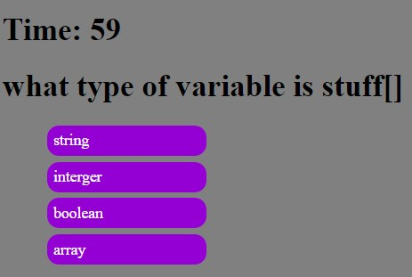

# Homework-4-CodingQuiz

This project had us coding a basic javascript quiz using HTML, CSS, and Javascript.
Most of this website uses Javascript with HTML being used for the skeleton and CSS for basic Styling. Used a lot of jquery to quickly pull elements from HTML and to efficiently create dynamic elements for the website.

The acceptance criteria for this project are as follows: 
GIVEN I am taking a code quiz
WHEN I click the start button
THEN a timer starts and I am presented with a question
WHEN I answer a question
THEN I am presented with another question
WHEN I answer a question incorrectly
THEN time is subtracted from the clock
WHEN all questions are answered or the timer reaches 0
THEN the game is over
WHEN the game is over
THEN I can save my initials and my score

Hosted by github @ https://squid300.github.io/Homework-4-CodingQuiz/